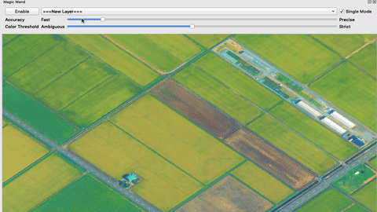

# MagicWand
QGIS plugin to make polygon easily and automatically by analyzing MapCanvas.

# Sample

# Usage
- Set Accuracy and Color Threshold, and Click mapcanvas where you want to make polygon.
- Single Mode enable you make ONE polygon around where you clicked.
- Higher Accuracy needs longer time.
- To make polygon apropriately, it is better adjust Saturation highly.

# Contact
kanahiro.iguchi@gmail.com