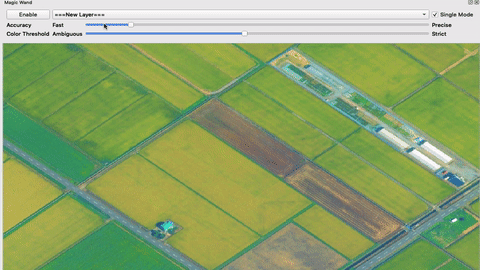

# MagicWand
QGIS plugin to make polygon easily and automatically by analyzing MapCanvas.

Supports QGIS 3.44 or later, including QGIS 4.x (Qt6).

# Sample


# Usage
- Click mapcanvas where you want to make polygon: a tentative polygon is shown semi-transparently, like the magic wand tool of image editors.
- A confirmation dialog opens; adjust the Color Threshold while watching the tentative polygon, then press OK to save it (Cancel discards it).
- Check Skip Preview to save polygons immediately on click, without the tentative polygon and its confirmation dialog.
- Polygons are added as layer edits (one undo step per click): press Ctrl+Z to undo a creation, and save the layer edits to make them permanent.
- The polygon is traced from the area connected to the clicked point (flood fill). Colors are compared perceptually (CIELAB delta-E), and the selection follows smooth gradients (region growing) while sharp color edges stop it.

# Processing algorithm

The same magic-wand selection is available as a processing algorithm
`magicwand:polygonizebyseeds` ("Polygonize by seed points"): it takes an
8-bit RGB raster and a seed point layer, and outputs one polygon set per
seed (with a `seed_id` attribute). To run it against styled map layers,
render them first with the built-in "Convert map to raster" algorithm.
Works in the model designer, batch mode, and `qgis_process`.

# Development

## Setup

```sh
# https://docs.astral.sh/uv/
uv sync
```

## Lint / Format

```sh
uv run ruff check .
uv run ruff format .
```

## Test

Tests run inside the official QGIS Docker image (same as CI):

```sh
docker run --rm -v "$(pwd)":/plugin -w /plugin qgis/qgis:3.44 sh -c "
  pip3 install --break-system-packages pytest pytest-qgis &&
  xvfb-run -s '+extension GLX -screen 0 1024x768x24' python3 -m pytest tests/ -v
"
```

## Release

Publishing a GitHub Release triggers `.github/workflows/release.yaml`, which
zips the plugin, uploads it as a release asset, and uploads it to
plugins.qgis.org (the release tag is written to `metadata.txt` as the version).

# Contact
kanahiro.iguchi@gmail.com
